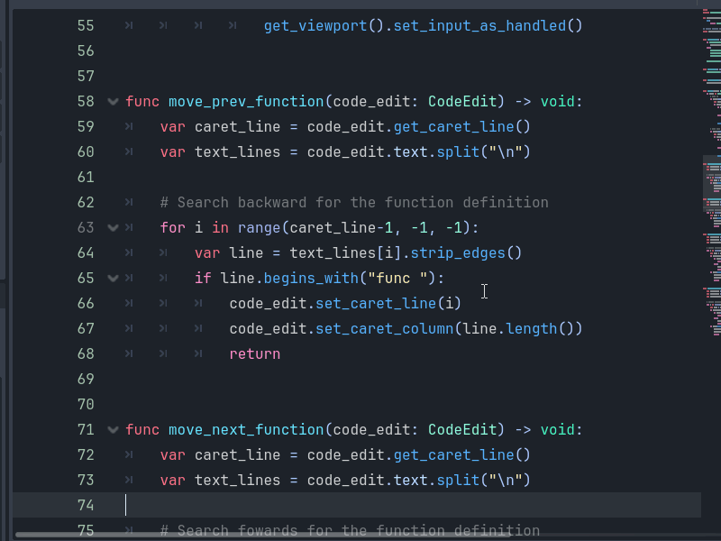

# Gdscript Space Block Jumper

Very simple plugin that let's you move around your code really fast with shortcuts.

Use *page-up* or *page-down* to jump to the next empty line.

You can also *hold shift* to to jump to func definitions.

Initially inspired by PICO-8 script editor where you use the 'page up/down' keys to move acress functions.

Shortcuts:
- Page Down : Go to next empty line
- Page Up : Go to previous empty line
- Shift + Page Down : Go to next 'func'
- Shift + Page Up : Go to previous 'func'

# Configuration

You can set the `Shift to Move Space Behavior` configuration in the ProjectSettings/Plugins/Gdscript Block Jumper.

If you enable this, the scroll commands will be switched.

PageUp/Down will scroll to func and shift+PageUp/Down will jump to empty lines

## Todo

- Add ability to select lines while jumping around
- Add configurable hotkeys
- Use some option+arrow combination to move, if configurable hotkeys doesn't work for that.
